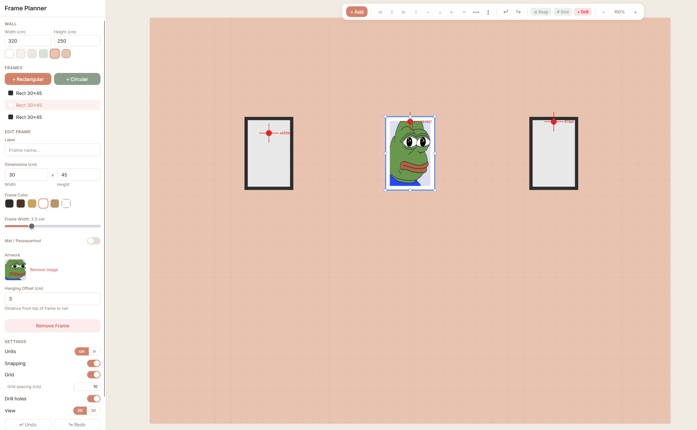

# Frame Planner

> Plan and visualise picture frame layouts on your wall before you pick up a drill.

[](LICENSE)
[](https://react.dev/)
[](https://www.typescriptlang.org/)

**Live Demo**: [frames.s33g.uk](https://frames.s33g.uk)



## What it does

- **2D canvas editor** — drag, resize, and arrange frames on a virtual wall
- **3D preview** — switch to a Three.js view to see how it looks in perspective
- **Snap guides & spacing** — alignment helpers and even-spacing guides between frames
- **Frame customisation** — shape (rect/ellipse), colour, mat border, labels
- **Drill hole overlay** — shows exact hanging points for installation
- **Installation guide** — generates measurements for real-world hanging
- **Undo/redo** — full history with keyboard shortcuts
- **Offline-first** — persists to IndexedDB, no account required
- **Responsive** — sidebar on desktop, bottom sheet on mobile

---

## Quick Start

```bash
git clone https://github.com/S33G/frame-planner.git
cd frame-planner
bun install
bun run dev
```

Open [http://localhost:5173](http://localhost:5173).

---

## Development

```bash
bun run dev       # Dev server
bun run build     # Production build
bun run lint      # ESLint
bun run preview   # Serve production build
```

### Tech Stack

| Layer     | Tech                                  |
| --------- | ------------------------------------- |
| Framework | React 19 + Vite 7                     |
| Language  | TypeScript 5 (strict)                 |
| Styling   | Tailwind CSS 4                        |
| 2D Canvas | Konva / react-konva                   |
| 3D        | Three.js / React Three Fiber + Drei   |
| State     | Zustand + Zundo (undo/redo)           |
| Storage   | idb-keyval (IndexedDB)                |
| Testing   | Vitest + Testing Library + Playwright |

### Project Structure

```
src/
├── components/
│   ├── canvas/       # 2D wall editor (Konva)
│   ├── three/        # 3D preview (R3F)
│   └── ui/           # Sidebar, toolbar, editors
├── hooks/            # Custom React hooks
├── services/         # Persistence, export
├── store/            # Zustand store
├── types/            # Frame, Wall, Units
└── utils/            # Geometry, snapping, helpers
```

---

## License

[MIT](LICENSE)
